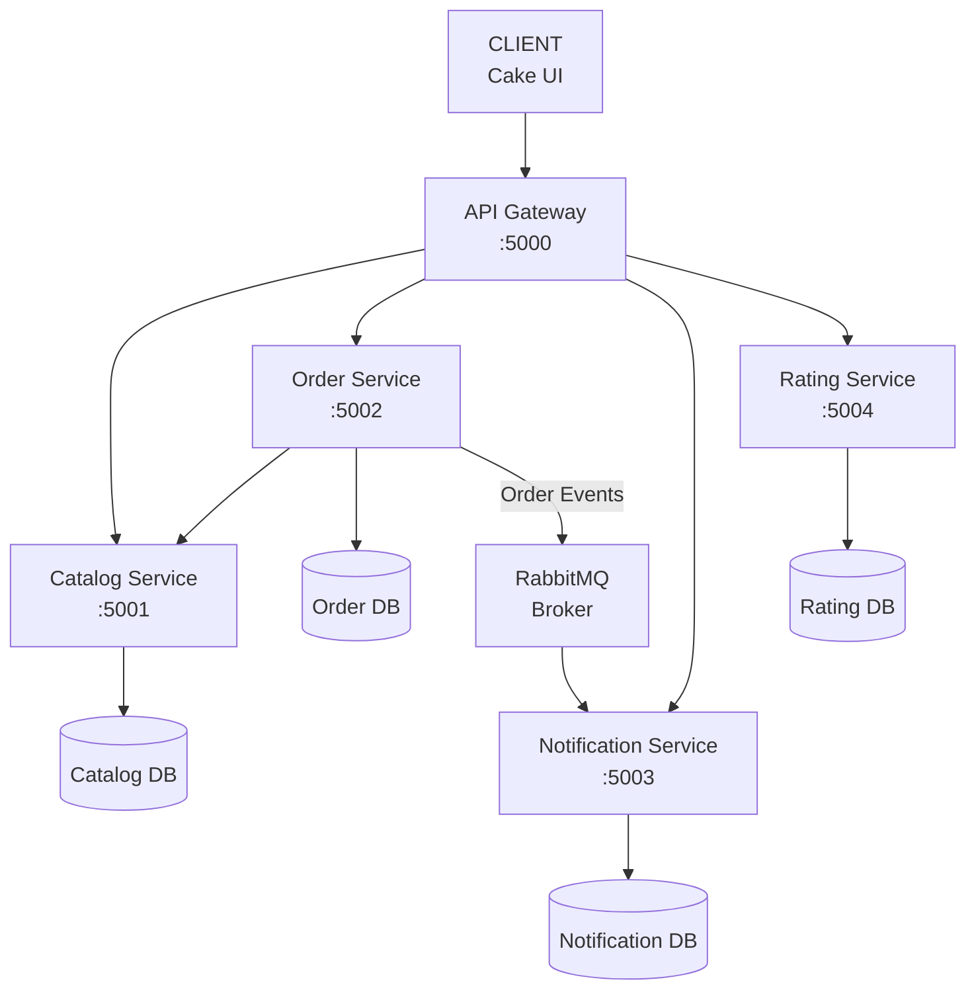
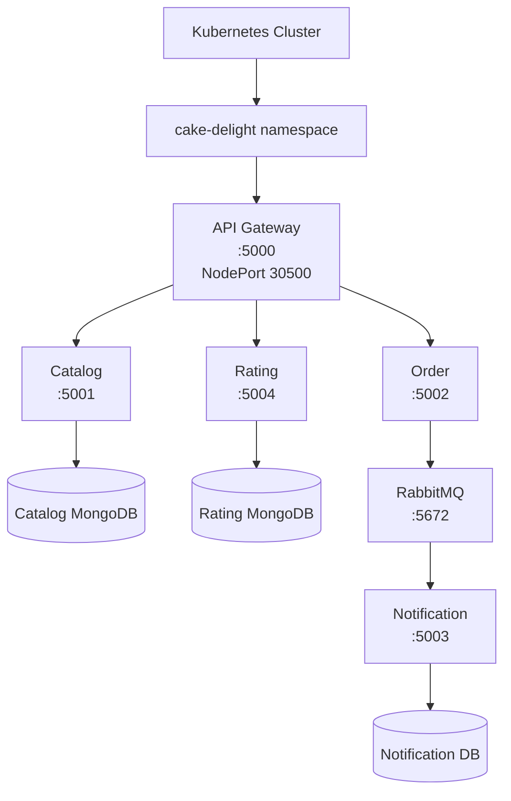
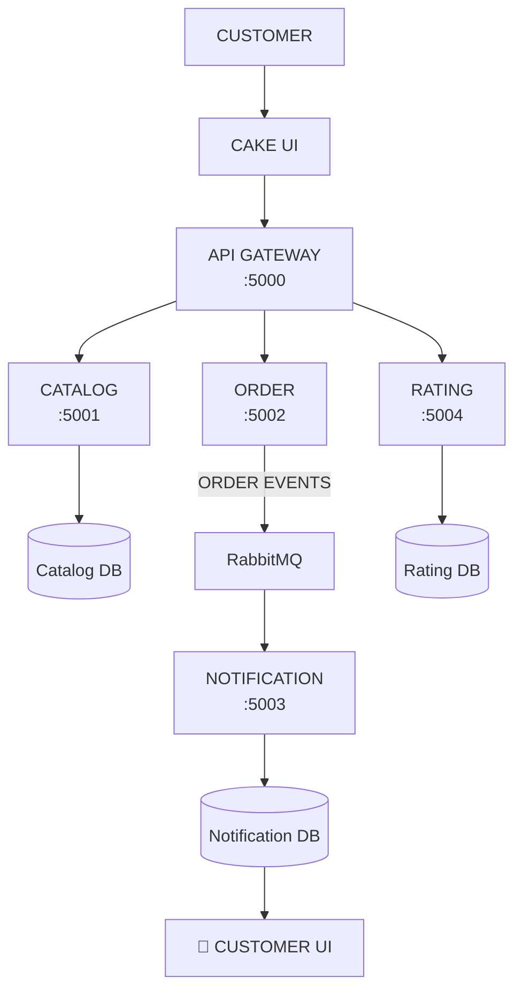

# 🎂 Cake Delight — Microservices Application

Cake Delight is a **cloud-native microservices-based cake ordering application** built using Node.js, Express.js, MongoDB, RabbitMQ, Docker, and related technologies.

The application is designed using a distributed microservices architecture where each service is responsible for a specific business capability.

The system currently consists of:

- 🍰 Catalog Microservice
- 🛒 Order Microservice
- 🔔 Notification Microservice
- ⭐ Rating Microservice
- 🚪 API Gateway
- 🐇 RabbitMQ Message Broker
- 🍃 MongoDB
- 🐳 Docker / Docker Compose

Each microservice can be developed, tested, and deployed independently while communicating with other services through REST APIs or asynchronous events.

---

# 📌 Table of Contents

1. [Project Overview](#-project-overview)
2. [Architecture](#-architecture)
3. [Microservices](#-microservices)
4. [Technology Stack](#-technology-stack)
5. [Service Ports](#-service-ports)
6. [Catalog Microservice](#-catalog-microservice)
7. [Order Microservice](#-order-microservice)
8. [Notification Microservice](#-notification-microservice)
9. [Rating Microservice](#-rating-microservice)
10. [API Gateway](#-api-gateway)
11. [RabbitMQ Event Architecture](#-rabbitmq-event-architecture)
12. [Complete Customer Workflow](#-complete-customer-workflow)
13. [Project Structure](#-project-structure)
14. [Database Architecture](#-database-architecture)
15. [API Gateway Routes](#-api-gateway-routes)
16. [Environment Configuration](#-environment-configuration)
17. [Running the Application Locally](#-running-the-application-locally)
18. [Running with Docker Compose](#-running-with-docker-compose)
19. [Swagger Documentation](#-swagger-documentation)
20. [Testing](#-testing)
21. [Error Handling](#-error-handling)
22. [Microservice Communication](#-microservice-communication)
23. [Future Enhancements](#-future-enhancements)

---

# 🎯 Project Overview

Cake Delight allows customers to browse cakes, manage a shopping basket, checkout and create orders, receive order-related notifications, and submit ratings and reviews.

The application is divided into independent microservices.

```text
                         Cake Delight
                              │
                              ▼
                       ┌─────────────┐
                       │ API Gateway │
                       │    :5000    │
                       └──────┬──────┘
                              │
             ┌────────────────┼────────────────┐
             │                │                │
             ▼                ▼                ▼
       Catalog :5001     Order :5002      Rating :5004
             │                │
             │                │
             │                ▼
             │             RabbitMQ
             │                │
             │                ▼
             │       Notification :5003
             │                │
             ▼                ▼
          MongoDB          MongoDB
```

The API Gateway acts as the public entry point for client requests.

The backend services remain responsible for their own business logic and data.

---

# 🏗️ Architecture

The overall Cake Delight architecture is:



---

# 🧩 Microservices

## 🍰 1. Catalog Microservice

**Port:** `5001`

The Catalog Service manages all cake-related information and inventory.

### Responsibilities

- Cake CRUD operations
- Cake details
- Cake categories
- Cake prices
- Cake stock
- Cake availability
- Search cakes by name
- Filter cakes by category
- Filter cakes by price range
- Pagination
- Sorting
- Stock management

### Additional Features

- Request validation
- Centralized error handling
- MongoDB integration
- Swagger/OpenAPI
- Interactive UI
- Health check
- CORS
- Helmet
- Morgan logging

### Base URL

```text
http://localhost:5001
```

---

# 🛒 2. Order Microservice

**Port:** `5002`

The Order Service is responsible for customer baskets, checkout, orders, order status management, cancellation, inventory interaction, and order events.

The Basket is implemented inside the Order Service rather than as a separate microservice.

### Responsibilities

#### Basket

- Add cakes to basket
- View customer basket
- Update basket quantity
- Remove basket items
- Clear basket
- Calculate basket subtotal
- Calculate basket total

#### Checkout

- Validate basket
- Retrieve cake details
- Validate availability
- Validate stock
- Calculate item subtotals
- Calculate order total
- Reduce cake stock
- Create order
- Clear basket
- Publish order event

#### Orders

- Create orders
- Get all orders
- Get order by ID
- Update order status
- Cancel orders
- Calculate totals
- Validate order data

#### Catalog Integration

The Order Service communicates with the Catalog Service to:

```text
Get Cake
   ↓
Validate Cake
   ↓
Check Availability
   ↓
Check Stock
   ↓
Reduce Stock
```

When an order is cancelled:

```text
Order Cancellation
       ↓
Restore Stock
       ↓
Catalog Service
```

### Order Status Flow

```text
PLACED
   │
   ├──→ CONFIRMED
   │       │
   │       ▼
   │   PREPARING
   │       │
   │       ▼
   │ OUT_FOR_DELIVERY
   │       │
   │       ▼
   │   DELIVERED
   │
   └──→ CANCELLED
```

Invalid status transitions are rejected.

### Base URL

```text
http://localhost:5002
```

---

# 🔔 3. Notification Microservice

**Port:** `5003`

The Notification Service manages customer notifications generated from order-related events.

It uses **RabbitMQ** as an asynchronous event consumer.

### Responsibilities

- Consume RabbitMQ order events
- Create notifications
- Store notifications in MongoDB
- Get all notifications
- Get notification by ID
- Get notifications by customer email
- Mark notifications as read
- Delete notifications
- Provide notification APIs
- Display notifications through the UI

### Supported Events

```text
ORDER_PLACED
ORDER_CONFIRMED
ORDER_PREPARING
ORDER_OUT_FOR_DELIVERY
ORDER_DELIVERED
ORDER_CANCELLED
```

### Notification Flow

```text
Order Service
      │
      │ Order Event
      ▼
   RabbitMQ
      │
      ▼
Notification Service
      │
      ▼
Create Notification
      │
      ▼
MongoDB
      │
      ▼
Notification UI
```

The Order Service does not directly create notifications inside the Notification Service.

RabbitMQ provides asynchronous communication between the services.

### Base URL

```text
http://localhost:5003
```

---

# ⭐ 4. Rating Microservice

**Port:** `5004`

The Rating Service manages customer ratings and reviews for cakes.

### Responsibilities

- Create ratings
- Create reviews
- Get all ratings
- Get rating by ID
- Get ratings for a specific cake
- Update ratings
- Delete ratings
- Validate rating and review data
- Prevent duplicate ratings from the same customer for the same cake

### Catalog Integration

The Rating Service UI communicates with the Catalog Service to load available cakes.

```text
Rating UI
    │
    ▼
Catalog Service
    │
    ▼
Available Cakes
    │
    ▼
Rating UI
```

### Base URL

```text
http://localhost:5004
```

---

# 🚪 5. API Gateway

**Port:** `5000`

The API Gateway is the **single entry point for client requests** in the Cake Delight microservices architecture.

Instead of the client communicating directly with every microservice, requests are sent to the API Gateway.

```text
Client
   │
   ▼
API Gateway :5000
   │
   ├── Catalog Service :5001
   ├── Order Service :5002
   ├── Notification Service :5003
   └── Rating Service :5004
```

### Responsibilities

- Centralized API entry point
- Request routing
- Service abstraction
- HTTP proxying
- CORS support
- JSON request handling
- Health check
- Error handling

The Gateway decides where a request should go.

The individual microservices continue to handle the actual business logic.

---

# 🔀 API Gateway Routes

| Gateway Route           | Target Service        |
| ----------------------- | --------------------- |
| `/api/catalog/*`        | Catalog Service       |
| `/api/orders/*`         | Order Service         |
| `/api/notifications/*`  | Notification Service  |
| `/api/ratings/*`        | Rating Service        |

### Example

Instead of directly calling:

```text
http://localhost:5001/api/cakes
```

the client can use:

```text
http://localhost:5000/api/catalog/cakes
```

The Gateway forwards the request to:

```text
Catalog Service :5001
```

---

# 🐇 RabbitMQ Event Architecture

RabbitMQ is used as the **message broker** for asynchronous communication between the Order and Notification Services.

The Order Service publishes events.

The Notification Service consumes those events.

```text
                    Order Service
                         │
                         │
              ┌──────────┴──────────┐
              │                     │
              ▼                     ▼
      ORDER_COMPLETED       ORDER_STATUS_UPDATED
              │                     │
              └──────────┬──────────┘
                         ▼
                    RabbitMQ
                         │
                         ▼
               Notification Service
                         │
                         ▼
                    MongoDB
                         │
                         ▼
                  Customer UI
```

## Order Completed

After successful checkout/order creation:

```text
Order Service
      │
      │ ORDER_COMPLETED
      ▼
RabbitMQ
      │
      ▼
Notification Service
      │
      ▼
Notification MongoDB
      │
      ▼
Customer Notification
```

## Order Status Updated

When an order status changes:

```text
Order Service
      │
      │ ORDER_STATUS_UPDATED
      ▼
RabbitMQ
      │
      ▼
Notification Service
      │
      ▼
Notification MongoDB
      │
      ▼
Customer Notification
```

---

# 🔄 Complete Customer Workflow

The complete Cake Delight customer workflow is:

```text
                    Customer
                       │
                       ▼
                   Cake UI
                       │
                       ▼
                API Gateway
                       │
                       ▼
              Catalog Service
                       │
                       ▼
                 Browse Cakes
                       │
                       ▼
                Select Cake
                       │
                       ▼
                Order Service
                       │
                       ▼
                 Add to Basket
                       │
                       ▼
                  View Basket
                       │
                       ▼
                   Checkout
                       │
                       ▼
             Validate Cake & Stock
                       │
                       ▼
              Reduce Cake Stock
                       │
                       ▼
                 Create Order
                       │
                       ▼
               Clear Basket
                       │
                       ▼
                  RabbitMQ
                       │
                       ▼
             ORDER_COMPLETED
                       │
                       ▼
           Notification Service
                       │
                       ▼
              Create Notification
                       │
                       ▼
                  MongoDB
                       │
                       ▼
              Customer Notification
```

---

# 🛒 Detailed Checkout Flow

```text
Customer
   │
   ▼
Order UI
   │
   ▼
Order Service
   │
   ├── Get Customer Basket
   │
   ├── Validate Basket
   │
   ├── Get Cake Details
   │
   ▼
Catalog Service
   │
   ├── Validate Cake
   ├── Check Availability
   └── Check Stock
   │
   ▼
Order Service
   │
   ├── Calculate Item Subtotals
   ├── Calculate Total
   └── Reduce Stock
   │
   ▼
Catalog Service
   │
   └── Update Stock
   │
   ▼
Order MongoDB
   │
   └── Create Order
   │
   ▼
Clear Basket
   │
   ▼
RabbitMQ
   │
   └── ORDER_COMPLETED
```

---

# ❌ Order Cancellation Flow

When an order is cancelled:

```text
Customer/Admin
      │
      ▼
Order Service
      │
      ├── Find Order
      ├── Validate Cancellation
      │
      ▼
Catalog Service
      │
      └── Restore Stock
      │
      ▼
Order Service
      │
      ├── Set status = CANCELLED
      │
      └── Publish Order Event
      │
      ▼
RabbitMQ
      │
      ▼
Notification Service
```

---

# ⭐ Rating Workflow

The Rating Service provides customer rating and review functionality.

```text
Customer
   │
   ▼
Cake UI
   │
   ▼
API Gateway
   │
   ▼
Rating Service
   │
   ├── Validate Rating
   ├── Validate Review
   ├── Check Duplicate Rating
   │
   ▼
Rating MongoDB
   │
   ▼
Rating Response
   │
   ▼
Cake UI
```

The Rating UI can communicate with the Catalog Service to retrieve available cakes.

---

# 🛠️ Technology Stack

| Technology                  | Purpose                         |
| --------------------------- | ------------------------------- |
| Node.js                     | JavaScript runtime              |
| Express.js                  | REST API framework              |
| MongoDB                     | Database                        |
| Mongoose                    | MongoDB ODM                     |
| Joi                         | Request validation              |
| Swagger / OpenAPI           | API documentation               |
| Swagger UI Express          | Interactive API testing         |
| RabbitMQ                    | Message broker                  |
| amqplib                     | RabbitMQ integration            |
| Axios / HTTP communication  | Inter-service communication     |
| HTML                        | Frontend structure              |
| CSS                         | Frontend styling                |
| JavaScript                  | Frontend API communication      |
| CORS                        | Cross-origin requests           |
| Helmet                      | Security headers                |
| Morgan                      | HTTP request logging            |
| dotenv                      | Environment configuration       |
| Nodemon                     | Development server              |
| Docker                      | Containerization                |
| Docker Compose              | Multi-service local deployment  |
| Git                         | Version control                 |
| GitHub                      | Source code management          |

---

# 🔌 Service Ports

| Component               |    Port |
| ----------------------- | ------: |
| API Gateway             |  `5000` |
| Catalog Service         |  `5001` |
| Order Service           |  `5002` |
| Notification Service    |  `5003` |
| Rating Service          |  `5004` |
| RabbitMQ                |  `5672` |
| RabbitMQ Management UI  | `15672` |

---

# 📁 Project Structure

```text
Cake_Delight_App/
│
├── api-gateway/
│
├── catalog-service/
│
├── order-service/
│
├── notification-service/
│
├── rating-service/
│
├── docker-compose.yml
│
├── architecture.txt
│
├── PATCH_NOTES.md
│
├── Changes_needed.txt
│
└── README.md
```

Each microservice is an independent Node.js application.

---

# 🗄️ Database Architecture

Each business microservice maintains its own MongoDB database.

```text
MongoDB
│
├── catalog_db
│
├── order_db
│
├── notification_db
│
└── rating_db
```

### Catalog Database

Responsible for:

- Cakes
- Prices
- Categories
- Stock
- Availability

### Order Database

Responsible for:

- Baskets
- Orders
- Order items
- Order totals
- Order status

### Notification Database

Responsible for:

- Notifications
- Customer notification state
- Read/unread status

### Rating Database

Responsible for:

- Ratings
- Reviews
- Customer rating information

---

# 🔗 Service Communication

Cake Delight uses two major communication styles.

## 1. Synchronous REST Communication

Used when one service needs an immediate response.

Example:

```text
Order Service
      │
      │ HTTP
      ▼
Catalog Service
      │
      ▼
Cake / Stock Information
```

The Order Service uses Catalog Service information to validate cakes and stock during basket and checkout operations.

---

## 2. Asynchronous Event Communication

Used for order-related notifications.

```text
Order Service
      │
      ▼
RabbitMQ
      │
      ▼
Notification Service
```

This prevents the Order Service from directly depending on the Notification Service for notification creation.

---

# 🌐 API Gateway Examples

Once the API Gateway is running, the client can use:

## Catalog

```http
GET http://localhost:5000/api/catalog/cakes
```

```http
GET http://localhost:5000/api/catalog/cakes/:id
```

---

## Orders

```http
GET http://localhost:5000/api/orders
```

```http
GET http://localhost:5000/api/orders/:id
```

```http
POST http://localhost:5000/api/orders/checkout/:customerEmail
```

---

## Ratings

```http
GET http://localhost:5000/api/ratings
```

```http
GET http://localhost:5000/api/ratings/:id
```

---

## Notifications

```http
GET http://localhost:5000/api/notifications
```

```http
GET http://localhost:5000/api/notifications/:id
```

---

# ❤️ API Gateway Health Check

```http
GET http://localhost:5000/health
```

Example response:

```json
{
  "success": true,
  "message": "API Gateway is running"
}
```

---

# 📖 Swagger Documentation

Each service provides interactive API documentation.

### Catalog

```text
http://localhost:5001/api-docs
```

### Order

```text
http://localhost:5002/api-docs
```

### Notification

```text
http://localhost:5003/api-docs
```

### Rating

```text
http://localhost:5004/api-docs
```

Swagger allows developers to:

- View API endpoints
- View request parameters
- View request bodies
- View responses
- Test APIs interactively

---

# 🖥️ Service UIs

Each major service provides a web-based UI.

### Catalog UI

```text
http://localhost:5001
```

### Order UI

```text
http://localhost:5002
```

### Notification UI

```text
http://localhost:5003
```

### Rating UI

```text
http://localhost:5004
```

The API Gateway provides the centralized backend entry point for client API requests.

---

# ⚙️ Environment Configuration

Each microservice uses environment variables for configuration.

Example Order Service:

```env
PORT=5002

MONGO_URI=mongodb://localhost:27017/order_db

CATALOG_SERVICE_URL=http://localhost:5001

RABBITMQ_URL=amqp://localhost:5672

EVENT_EXCHANGE=cake_delight_events
```

API Gateway:

```env
PORT=5000

CATALOG_SERVICE_URL=http://localhost:5001/api/catalog
ORDER_SERVICE_URL=http://localhost:5002/api/orders
NOTIFICATION_SERVICE_URL=http://localhost:5003/api/notifications
RATING_SERVICE_URL=http://localhost:5004/api/ratings
```

Environment files containing secrets or local configuration should not be committed to GitHub.

Use `.env.example` files as configuration templates.

---

# ▶️ Running the Application Locally

## Prerequisites

Install:

- Node.js
- npm
- MongoDB
- RabbitMQ
- Git

Optional development tools:

- VS Code
- Postman
- Docker
- Docker Compose

---

## 1. Clone the Repository

```bash
git clone <your-repository-url>
```

Navigate to the project:

```bash
cd Cake_Delight_App
```

---

## 2. Install Dependencies

Install dependencies inside each service:

```bash
cd catalog-service
npm install
```

```bash
cd ../order-service
npm install
```

```bash
cd ../notification-service
npm install
```

```bash
cd ../rating-service
npm install
```

```bash
cd ../api-gateway
npm install
```

---

# ▶️ Start the Services

Each service can be started independently.

### Catalog

```bash
cd catalog-service
npm run dev
```

Runs on:

```text
http://localhost:5001
```

### Order

```bash
cd order-service
npm run dev
```

Runs on:

```text
http://localhost:5002
```

### Notification

```bash
cd notification-service
npm run dev
```

Runs on:

```text
http://localhost:5003
```

### Rating

```bash
cd rating-service
npm run dev
```

Runs on:

```text
http://localhost:5004
```

### API Gateway

```bash
cd api-gateway
npm run dev
```

Runs on:

```text
http://localhost:5000
```

---

# 🐳 Running with Docker Compose

The project includes a Docker Compose configuration for running the Cake Delight services together.

The intended architecture is:

```text
Docker Compose
      │
      ├── API Gateway
      ├── Catalog Service
      ├── Order Service
      ├── Notification Service
      ├── Rating Service
      ├── RabbitMQ
      └── MongoDB
```

Build and start the application:

```bash
docker compose up --build
```

Run in detached mode:

```bash
docker compose up -d --build
```

View running containers:

```bash
docker compose ps
```

View logs:

```bash
docker compose logs
```

Stop the application:

```bash
docker compose down
```

---

# ☸️ Kubernetes Deployment

Cake Delight is also deployed and tested on Kubernetes using the Docker Desktop Kubernetes cluster.

The Kubernetes resources are organized under the `k8s/` directory.

## Kubernetes Namespace

All Cake Delight resources are deployed into:

```text
cake-delight
```

Create the namespace:

```powershell
kubectl apply -f k8s/namespace.yaml
```

Verify:

```powershell
kubectl get namespace cake-delight
```

## Kubernetes Resources

The deployment includes:

```text
Kubernetes Cluster
│
└── cake-delight namespace
    │
    ├── API Gateway
    │
    ├── Catalog Service
    │
    ├── Order Service
    │
    ├── Notification Service
    │
    ├── Rating Service
    │
    ├── Catalog MongoDB
    │
    ├── Order MongoDB
    │
    ├── Notification MongoDB
    │
    ├── Rating MongoDB
    │
    └── RabbitMQ
```

## Kubernetes Manifest Structure

```text
k8s/
│
├── namespace.yaml
│
├── mongodb/
│   ├── catalog-mongodb.yaml
│   ├── order-mongodb.yaml
│   ├── notification-mongodb.yaml
│   └── rating-mongodb.yaml
│
├── rabbitmq/
│   └── rabbitmq.yaml
│
├── catalog/
│   └── ...
│
├── order/
│   └── ...
│
├── notification/
│   └── ...
│
├── rating/
│   └── ...
│
└── gateway/
    └── ...
```

## Deployment Order

The infrastructure is deployed first, followed by the application services.

### 1. MongoDB

```powershell
kubectl apply -f k8s/mongodb/ -n cake-delight
```

### 2. RabbitMQ

```powershell
kubectl apply -f k8s/rabbitmq/ -n cake-delight
```

### 3. Catalog Service

```powershell
kubectl apply -f k8s/catalog/ -n cake-delight
```

### 4. Order Service

```powershell
kubectl apply -f k8s/order/ -n cake-delight
```

### 5. Notification Service

```powershell
kubectl apply -f k8s/notification/ -n cake-delight
```

### 6. Rating Service

```powershell
kubectl apply -f k8s/rating/ -n cake-delight
```

### 7. API Gateway

```powershell
kubectl apply -f k8s/gateway/ -n cake-delight
```

The services can also be applied from the project root without explicitly passing `-n` when the manifests already define the namespace.

## Kubernetes Services

The application uses Kubernetes `ClusterIP` services for internal communication.

```text
catalog-service        ClusterIP
order-service          ClusterIP
notification-service   ClusterIP
rating-service         ClusterIP
rabbitmq               ClusterIP
```

The API Gateway is exposed using a `NodePort`:

```text
api-gateway
Port:     5000
NodePort: 30500
```

## Internal Kubernetes Service Communication

Inside the Kubernetes cluster, services communicate using Kubernetes DNS names.

Examples:

```text
http://catalog-service:5001
http://order-service:5002
http://notification-service:5003
http://rating-service:5004
amqp://rabbitmq:5672
```

This is different from local development, where services use `localhost`.

For example, the Notification Service successfully connects to RabbitMQ using:

```text
amqp://rabbitmq:5672
```

## Kubernetes Verification

Check all pods:

```powershell
kubectl get pods -n cake-delight
```

Check services:

```powershell
kubectl get services -n cake-delight
```

Check deployments:

```powershell
kubectl get deployments -n cake-delight
```

Check pod logs:

```powershell
kubectl logs deployment/catalog-service -n cake-delight
kubectl logs deployment/order-service -n cake-delight
kubectl logs deployment/notification-service -n cake-delight
kubectl logs deployment/rating-service -n cake-delight
kubectl logs deployment/api-gateway -n cake-delight
```

The final tested Kubernetes environment contains:

```text
api-gateway
catalog-service
order-service
notification-service
rating-service

catalog-mongodb
order-mongodb
notification-mongodb
rating-mongodb

rabbitmq
```

All application pods were verified in the `Running` state during end-to-end testing.

---

# ☸️ Kubernetes Architecture

The Kubernetes deployment follows this structure:



---

# 🔍 Kubernetes Commands

## Check Nodes

```powershell
kubectl get nodes
```

## Check Nodes with Details

```powershell
kubectl get nodes -o wide
```

## Check Pods

```powershell
kubectl get pods -n cake-delight
```

## Check Services

```powershell
kubectl get services -n cake-delight
```

## Check Deployments

```powershell
kubectl get deployments -n cake-delight
```

## Describe a Pod

```powershell
kubectl describe pod <pod-name> -n cake-delight
```

## View Logs

```powershell
kubectl logs deployment/api-gateway -n cake-delight
```

## Restart a Deployment

```powershell
kubectl rollout restart deployment/api-gateway -n cake-delight
```

## Check Rollout Status

```powershell
kubectl rollout status deployment/api-gateway -n cake-delight
```

## Delete a Resource

```powershell
kubectl delete -f k8s/gateway/ -n cake-delight
```

## Port Forwarding

For reliable local access to a ClusterIP service:

```powershell
kubectl port-forward service/catalog-service 5001:5001 -n cake-delight
```

```powershell
kubectl port-forward service/order-service 5002:5002 -n cake-delight
```

```powershell
kubectl port-forward service/notification-service 5003:5003 -n cake-delight
```

```powershell
kubectl port-forward service/rating-service 5004:5004 -n cake-delight
```

For the API Gateway:

```powershell
kubectl port-forward service/api-gateway 5000:5000 -n cake-delight
```

Then:

```text
http://localhost:5000
```

The API Gateway port-forward was used during end-to-end testing and successfully exposed:

```text
/health
/api/catalog/*
/api/orders/*
/api/notifications/*
/api/ratings/*
```

## Kubernetes API Gateway Access

The Gateway Service is configured as:

```text
Type:     NodePort
Port:     5000
NodePort: 30500
```

Depending on the local Kubernetes environment, direct access through:

```text
http://localhost:30500
```

may not be available.

For the Docker Desktop Kubernetes environment used for this project, the verified local access method is:

```powershell
kubectl port-forward service/api-gateway 5000:5000 -n cake-delight
```

Then use:

```text
http://localhost:5000
```

This was the verified method used for the final end-to-end UI testing.

---

# 🧪 Testing

The services can be tested using:

- Swagger UI
- Postman
- Service UIs
- API Gateway

## Catalog Testing

Test:

```text
Create Cake
   ↓
Get Cake
   ↓
Update Cake
   ↓
Search Cake
   ↓
Filter Cake
   ↓
Update Stock
   ↓
Delete Cake
```

---

## Basket Testing

```text
Browse Cake
    ↓
Add Cake
    ↓
View Basket
    ↓
Update Quantity
    ↓
Remove Item
    ↓
Clear Basket
```

---

## Checkout Testing

```text
Available Cake
      +
Sufficient Stock
      ↓
Checkout
      ↓
Order Created
      +
Stock Reduced
      +
Basket Cleared
      +
ORDER_COMPLETED
```

---

## Insufficient Stock

```text
Requested Quantity
        >
Available Stock
        ↓
Checkout Rejected
        +
Stock Unchanged
```

---

## Order Cancellation

```text
Order Created
      ↓
Stock Reduced
      ↓
Order Cancelled
      ↓
Stock Restored
      ↓
Notification Event
```

---

## Notification Testing

```text
Order Event
    ↓
RabbitMQ
    ↓
Notification Service
    ↓
Notification Created
    ↓
MongoDB
    ↓
Notification UI
```

---

## Rating Testing

```text
Select Cake
    ↓
Submit Rating
    ↓
Validate Rating
    ↓
Check Duplicate
    ↓
Save Rating
    ↓
View Rating
```

---

# 🔐 Error Handling

The services implement centralized error handling and request validation.

Examples of errors handled include:

- Invalid request data
- Invalid IDs
- Missing required fields
- Invalid customer email
- Cake not found
- Cake unavailable
- Insufficient stock
- Invalid basket quantity
- Invalid order status transition
- Invalid cancellation
- Duplicate ratings
- Database errors
- Catalog Service communication errors
- RabbitMQ communication errors

---

# 🧱 Microservice Design Principles

Cake Delight follows several important microservice principles.

### Independent Services

Each service has its own responsibility.

```text
Catalog       → Cakes & Inventory
Order         → Basket & Orders
Notification  → Notifications
Rating        → Ratings & Reviews
Gateway       → Request Routing
```

### Database Ownership

Each business service manages its own database.

### Loose Coupling

Services communicate through defined APIs and events.

### Event-Driven Communication

RabbitMQ is used for asynchronous order-related events.

### Layered Architecture

The backend services use a layered structure:

```text
Routes
   ↓
Controllers
   ↓
Services
   ↓
Models
   ↓
Database
```

---

# 🔄 Complete System Architecture

The final logical architecture can be summarized as:



---

# 📦 Repository Components

| Component               | Responsibility             |  Port |
| ----------------------- | -------------------------- | ----: |
| `catalog-service`       | Cakes & inventory          |  5001 |
| `order-service`         | Basket, checkout & orders  |  5002 |
| `notification-service`  | Order notifications        |  5003 |
| `rating-service`        | Ratings & reviews          |  5004 |
| `api-gateway`           | Central request routing    |  5000 |
| RabbitMQ                | Asynchronous messaging     |  5672 |
| MongoDB                 | Persistent data storage    | 27017 |

---

# 🚀 Future Enhancements

Possible future improvements include:

- User authentication
- JWT authorization
- Customer accounts
- Online payment integration
- Email order confirmation
- Customer order history
- Service discovery
- Kubernetes deployment
- Centralized logging
- Distributed tracing
- Production-grade observability
- Outbox pattern
- Retry mechanisms
- Dead-letter queues
- Improved API Gateway security
- Rate limiting
- Production monitoring

---

# 🎓 Learning Objectives

This project demonstrates practical implementation of:

- Node.js
- Express.js
- REST APIs
- Microservices architecture
- MongoDB
- Mongoose
- Joi validation
- Swagger/OpenAPI
- Inter-service communication
- RabbitMQ
- Event-driven architecture
- API Gateway
- Docker
- Docker Compose
- Git
- GitHub
- Frontend API integration
- Error handling
- Service-level documentation

The project is designed to provide practical experience with the development and integration of cloud-native microservices.

---

# 🐳 Docker Images

Each application microservice has its own Docker image.

```text
cake_delight_2-api-gateway
cake_delight_2-catalog-service
cake_delight_2-order-service
cake_delight_2-notification-service
cake_delight_2-rating-service
```

The images are used by Docker Compose and the Kubernetes deployment.

Example:

```powershell
docker images
```

The Kubernetes cluster used for this project runs with the containerd runtime provided by Docker Desktop Kubernetes.

---

# 📄 Project Status

```text
Catalog Service             ✅ Completed
Order Service               ✅ Completed
Basket                      ✅ Completed
Checkout                    ✅ Completed
RabbitMQ Publisher          ✅ Completed
Notification Service        ✅ Completed
RabbitMQ Consumer           ✅ Completed
Notification UI             ✅ Completed
Rating Service              ✅ Completed
API Gateway                 ✅ Completed
Docker Compose              ✅ Completed
Architecture Documentation  ✅ Completed
```

---

# 👨‍💻 Project

**Cake Delight — Microservices Application**

Built as a cloud-native microservices project using Node.js, Express.js, MongoDB, RabbitMQ, Docker, and related technologies.

Each microservice is independently structured, documented, and testable while participating in the overall Cake Delight application architecture.
